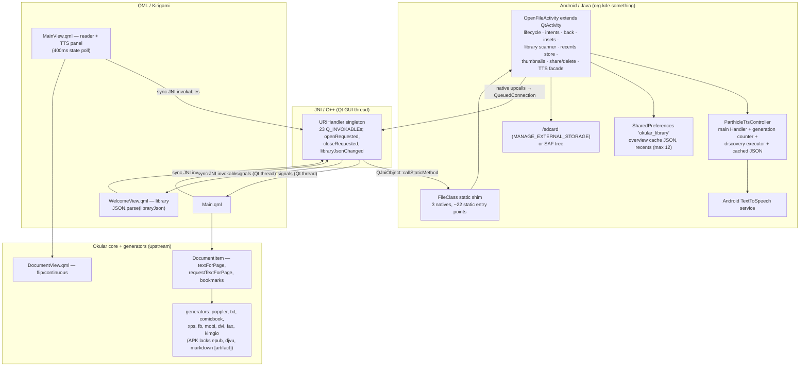
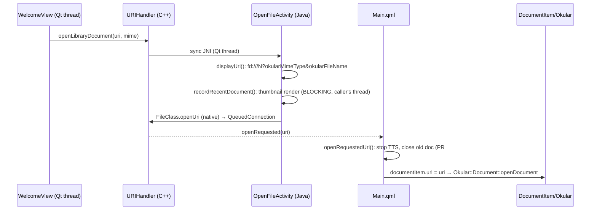

# Parthicle Reader — current-state architecture

Date: 2026-07-12 · Produced by the head-to-toe review (Fable 5, with the `parthicle-architecture-reviewer` subagent). Read-only audit of branch `review/head-to-toe-2026-07-12` (content-identical to GitHub `main`, `a5f11dbf5`), clean tree.

Evidence classes: **[runtime]** = the 2026-07-05 device QA audit of the v0.3.0 APK (Samsung SM-M356B, Android 16) — the only runtime evidence that exists; **[artifact]** = APK inspection; **[build]** = commands run during this review; **[static]** = source inspection; **[history]** = git/GitHub; **[inference]**; **[opinion]**. All post-PR-#20 behavior is [static]/[inference] — no device has run that code.

---

## 1. System overview

Parthicle Reader is a three-layer bridge wrapped around an essentially untouched Okular core:

1. **Android/Java** (`org.kde.something`): `OpenFileActivity` (1,821 lines) — lifecycle, intents, back handling, window insets, library scanning, recents persistence, thumbnail rendering, share/delete, and a TTS facade over `ParthicleTtsController`. A static `FileClass` shim exposes ~22 static entry points and 3 `native` methods.
2. **JNI/C++** (`mobile/app/android.cpp/.h`): a `URIHandler` singleton exported to QML as context property `uriHandler` — 23 `Q_INVOKABLE`s, signals `openRequested`/`closeRequested`/`libraryJsonChanged`. All Java→C++ upcalls are marshalled to the Qt thread via `Qt::QueuedConnection` (the `openUri` path gained this in PR #20).
3. **QML/Kirigami** (`mobile/app/ui/`): `Main.qml` (window/navigation), `WelcomeView.qml` (library, 870 lines), `MainView.qml` (reader chrome + TTS panel, 1,049 lines), plus upstream-shaped `mobile/components/` (`DocumentItem` wrapping `Okular::Document`, `DocumentView.qml`, `PageItem`).

Okular `core/` and `generators/` are upstream; Parthicle's additions there are limited to `documentitem.cpp` text-for-page/TTS plumbing and `DocumentView.qml` continuous-scroll/fit work [static][history].

### Component diagram



## 2. Threading model [static]

Three thread domains cross the bridge:

- **Android main thread:** lifecycle, `onNewIntent`, insets, and all TTS engine mutations (posted via `mainHandler`).
- **Qt GUI thread:** all QML plus every synchronous `QJniObject` downcall — so Java work like `displayUri()` (fd opening, cursor queries, and a **synchronous PDF thumbnail render** in `recordRecentDocument`, OpenFileActivity.java:1043–1085) executes on the Qt thread for library taps and on the Android main thread for hot intents. This is the app's most important hidden structure and its main jank source [static].
- **Workers:** one ad-hoc scanner thread per `publishLibrary()`; the TTS `discoveryExecutor` (added by PR #20 to get binder calls out from under locks — the freeze mitigation); binder callback threads for utterance progress.

All native→C++ upcalls queue onto the Qt thread. Pre-PR-#20, `openUri` did not — the credible root cause of the confirmed "hot ACTION_VIEW silently ignored" bug [runtime QA bug #2; static diff analysis].

## 3. Key sequences

### Opening a document



Hot ACTION_VIEW (post-PR-#20, unverified [static]): `singleTask` routes to `onNewIntent` → `handleViewIntent()` on the Android main thread → same queued `openUri` path. Cold start: `main.cpp` calls `handleViewIntent()` before the event loop; the queued signal fires once the loop spins.

### TTS

```mermaid
sequenceDiagram
    participant Q as MainView (Qt thread)
    participant C as ParthicleTtsController
    participant H as Android main Handler
    participant X as discoveryExecutor
    participant E as TTS engine (binder)
    Note over C: activity onCreate → init default engine on main Handler
    E-->>H: onInit → fallback to default engine if requested engine fails
    H->>X: refreshDiscoveryCache (getEngines/getVoices OFF main thread)
    X->>C: cache enginesJson/voicesJson, state="ready"
    Note over Q: Listen tap → poll ttsStateJson every 400ms (cached reads)
    Q->>Q: Play → requestTextForPage (sync text extraction, Qt thread)
    Q->>C: ttsSpeak(text) → chunk → mainHandler → engine.speak(QUEUE_FLUSH/ADD)
    E-->>C: onStart/onDone (binder thread) → synchronized state machine
    Note over Q: stop on page change/url change/returnToLibrary; shutdown in onDestroy
```

There is **no Java→QML push channel for TTS** — completion is visible to QML only through the 400 ms poll. Document narration (page auto-advance) is architecturally impossible until a `ttsStateChanged`-style native upcall exists [static].

### Build → release

Docker + KDE Craft (Linux CraftRoot) → CMake/ECM → `androiddeployqt` (deployment JSON; known hazards: android-35/36 platform mismatch, malformed `stdcpp-path`, case-collapsed KIO headers — docs/build/android-kde-docker-notes.md) → debug-signed arm64-v8a APK (~88 MB) → `scripts/verify-*.ps1` + release checklist + hooks → GitHub pre-release with `.sha256`. There is **no Dockerfile or pinned image in-repo**; the container is hand-built and irreproducible by a second developer today [static].

## 4. Boundary/risk table

| Boundary | Coupling | Lifecycle risk | Threading | Key failure modes |
| --- | --- | --- | --- | --- |
| Java↔JNI (FileClass⇄URIHandler) | High, stringly-typed (hand-written descriptors + JSON blobs, no schema) | `FileClass.currentActivity` never cleared in `onDestroy` → leak + stale dispatch [static] | Downcalls on caller's thread; upcalls queued | Descriptor drift (mitigated by verify-bridge [build]); silent no-ops after half-death; jank from blocking JNI |
| C++↔QML (`uriHandler`) | Medium; 23 invokables on one god interface (documents + library + insets + share/delete + 9 TTS methods) | Low | Qt thread | **verify-bridge checks only MainView.qml** — WelcomeView/Main.qml calls unchecked (verify-bridge.ps1:34) [static] |
| QML↔Okular core | Low-medium, upstream-shaped | Password retry on consumed `fd:///` likely broken [inference] | Pixmaps async; **TTS text extraction synchronous on Qt thread** | Large scanned page stalls UI; `Main.qml:107` resets `currentPage=0`, defeating Okular docdata resume [static] |
| Activity↔Qt lifecycle | High; three parallel back-handling mechanisms | `configChanges` masks recreation; `savedInstanceState` unused; no process-death story | onNewIntent on Android main | Lost document on process death [runtime]; predictive-back likely broken [inference] |
| App↔storage | Two parallel models (raw walk vs SAF), separate JSON builders | Full rescan on every `onResume` | Scan on worker thread | O(all files) rescan; multi-MB JSON in SharedPreferences; URI-string identity duplicates recents [runtime] |
| App↔TTS service | Medium, well-isolated; best-designed contract in the app | Generation counter disciplined; shutdown in onDestroy ✓ | Mutations on main Handler; discovery on executor (now diverges from AGENTS.md gate #2 wording) | Freeze-class regressions if binder-under-lock returns; 400 ms poll misses transitions; Samsung logspam |
| Source↔build container | High, undocumented-executable | CraftRoot cache corruption (KIO case collapse) [history] | n/a | "Works on my container"; silent generator omissions (Markdown claimed, absent [runtime]; EPUB/DjVu absent [artifact]) |
| Build↔release | Checklist + hooks + scripts = real evidence gate [build] | Version identity manual: v0.3.1-named APK embeds 0.3.0/code 10 [artifact], issue #21 | n/a | Filename-vs-identity drift (has already happened); apksigner discovery gap (issue #3) |

## 5. Architecture verdicts (Phase 8)

1. **Qt/Kirigami remains the right shell** — the product's moat is Okular's generator breadth; costs (88 MB APK, ~8 s cold start [runtime], bespoke container) are real but no alternative preserves the breadth. Keep. [opinion, high confidence]
2. **Java/C++/QML boundary: maintainable at current size, decaying trendline.** Small surface + a genuinely good static checker, but three stringly-typed contracts (JNI descriptors, library JSON, TTS JSON) with no schema validation, and checker coverage gaps. [static, high]
3. **OpenFileActivity is a god object** (≥7 responsibilities in 1,821 lines). Concrete symptom: PR #20 fixed off-thread `Toast`s in the delete path but the identical defect remains in the share path (OpenFileActivity.java:529, 551) — on the Qt thread these throw and the exception is cleared at the JNI boundary, so share feedback silently never appears [static]. Split into `LibraryRepository`/`RecentsStore`/`ThumbnailCache` without touching bridge signatures. [static, high]
4. **Lifecycle/intents: materially improved on paper by PR #20** (singleTask + queued openUri + close-then-open QML routing — the correct diagnosis of the confirmed hot-VIEW bug), **zero runtime confidence** until device-tested. No `savedInstanceState`, no process-death restore. [static/inference, medium]
5. **Library scanning will not scale** past a few thousand files: full storage walk per resume, whole-library JSON through JNI, `JSON.parse` + per-keystroke JS filtering in QML, multi-MB SharedPreferences values. Works today [runtime]; cliff exists [static, high].
6. **DB-backed index: not yet.** Two cheaper steps first: MediaStore query instead of raw recursion; move the cache out of SharedPreferences. Adopt Room/SQLite only when reading progress/sort/dedup demand persistent per-document state. [opinion, medium-high]
7. **Document identity needs normalization now** — recents key = exact URI string (OpenFileActivity.java:1072); `/sdcard` vs `/storage/emulated/0` duplicates confirmed [runtime], unfixed by PR #20 [static]. Prerequisite for progress, dedup, stale cleanup. [static, high]
8. **No session-restore model exists, and the code fights the inherited one:** Okular docdata viewport restore is defeated by `currentPage = 0` on every open (Main.qml:107). Minimal coherent model: stop resetting; persist last-document key + page in existing prefs; surface real progress on recent cards. No new natives needed. [static, high]
9. **TTS should evolve page-scoped → document narration** in three steps: push channel (kills the poll), auto-advance, foreground service + MediaSession (Android 16 mutes backgrounded audio [runtime]). [static+runtime, high]
10. **OCR:** optional in-process module invoked from the "no extractable text" path, after narration ships; engine licensing (Tesseract vs ML Kit) needs review first. [opinion, medium]
11. **Package rename: applicationId first, before any wider tester cohort** (side-loads can't migrate identity; every tester loses data later). The Java package `org.kde.something` is welded into JNI export symbols and 22 string literals — defer that mechanical rename separately. [static, high]
12. **MANAGE_EXTERNAL_STORAGE:** acceptable for side-loaded prototypes; a Play Store blocker for a document reader with a viable SAF path [research/policy]. `INTERNET` is requested and unused — remove it. The artifact also carries `POST_NOTIFICATIONS` not present in the source manifest (manifest-merge injection [inference]) — explain or exclude before privacy claims. [artifact/static, high]
13. **Release discipline: above-average process, one mechanical hole** — nothing ties embedded APK identity to the tag; the hole has already produced a mislabeled artifact (issue #21) [artifact].
14. **Build reproduction: not realistic today** — no Dockerfile, no pinned versions in-repo; excellent diagnostic notes presuppose an existing container. [static, high]
15. **CI: feasible, staged** — stage 1 (verify scripts + lint) immediately; stage 2 nightly containerized APK; stage 3 emulator smoke. [inference/research, medium]
16. **Rewrite: rejected.** Every verified failure was Parthicle-authored integration glue, not the substrate; a native rewrite forfeits format breadth for nothing. Staged refactoring (this section) is the alternative. [opinion grounded in runtime+static evidence, high]

## 6. Immediate corrections (smallest first)

1. Mechanical release-identity gate (manifest versionName/Code vs tag) — closes issue #21's class.
2. Extend `verify-bridge.ps1` QML coverage to `WelcomeView.qml` + `Main.qml` (one-line change).
3. Fix residual off-thread Toasts in `shareCurrentDocument` (same class as PR #20's delete fix).
4. Clear `FileClass.currentActivity` in `onDestroy`.
5. Move `recordRecentDocument` thumbnail render off the calling thread.
6. Normalize recents/document identity (canonical path / SAF docId).
7. Remove `currentPage = 0` reset after verifying docdata writes on Android.
8. Reconcile AGENTS.md gate #2 wording with PR #20's executor-based discovery (policy and code currently disagree; future agents may "fix" the wrong side).

## 7. Uncertainty register

| # | Uncertainty | Impact | Resolution |
| --- | --- | --- | --- |
| U1 | All post-PR-#20 runtime behavior (freeze, hot VIEW, delete return, TTS fallback) untested on any device | High | Build from HEAD; run the smoke matrix on SM-M356B |
| U2 | v0.3.1-named APK's code provenance vs commit 6003384e6 unconfirmed (embeds 0.3.0 identity) | Medium | Rebuild from tagged commit; compare |
| U3 | POST_NOTIFICATIONS origin (manifest merge?) | Low | Inspect merged manifest in build tree |
| U4 | singleTask + queued openUri on One UI OEM routing | High for default-reader job | Device regression |
| U5 | Whether Okular docdata persists on Android at all | Medium (restore plan assumes it) | Navigate, close, inspect app files dir |
| U6 | Freeze root cause never stack-confirmed (behavioral evidence only) | Medium | Debuggable build + StrictMode/watchdog |
| U7 | Scale limits of prefs-cached library JSON / single JNI string | Medium at 10k+ files | 10k-file fixture measurement |
| U8 | Markdown generator absence inferred from runtime + Discount gating; not confirmed against Craft manifest | Low | List APK plugins; check Craft blueprints |
| U9 | Password retry on fd-backed content URIs suspected broken | Low-medium | Device test with password PDF via SAF |
| U10 | KDE-style Craft CI on GitHub runners assumed feasible, not prototyped | Medium for CI plan | Prototype stage-2 workflow |

Companion documents: `docs/reviews/parthicle-head-to-toe-review-2026-07-12.md` (full review), `docs/design/parthicle-design-principles.md`, `docs/strategy/parthicle-long-horizon-roadmap.md`, `docs/ai/parthicle-harness-v2-plan.md`.
